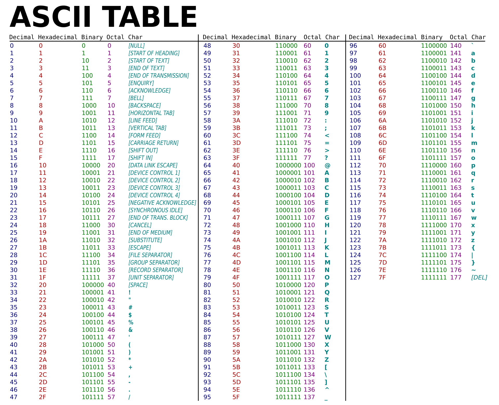
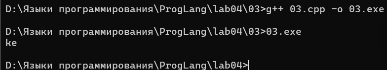
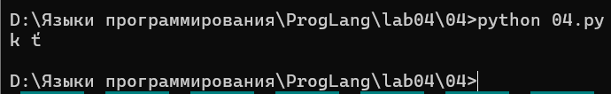
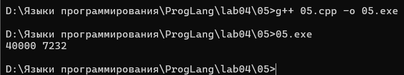
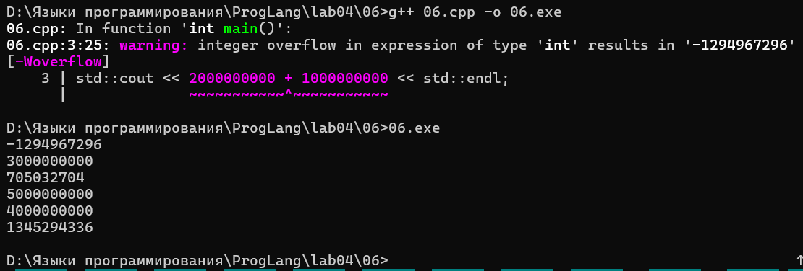

# Языки программирования
## Лабораторная работа 4

### Задание 1 **(3)**
* *Запишите двоичное представление числа -99 в целочисленном знаковом типе длиной 1, 2, 4 байта.*  
Ответ:  
длиной в 1 байт: -99 = 10011101  
длиной в 2 байт: -99 = 11111111 10011101  
длиной в 4 байт: -99 = 11111111 11111111 11111111 10011101  
 
* *Запишите литералы равные наибольшему и наименьшему числу в типе* **int** *в шестнадцатеричной записи.*  
Ответ:  
для наибольшего числа в типе **int** = 0x7FFFFFFF  
для наименьшего числа в типе **int** = 0x80000000  

* *Запишите двоичное представление символа "`#`" в типе* **char**.  
Ответ: двоичное представление символа "`#`" = 00100011

### Задание 2 **(3)**
*Напишите пример программы на С++ с использованием целочисленных литералов в разных форматах записи, 
разной длины, знаковых и беззнаковых. 
Пример должен охватывать большинство способов записи целочисленных литералов.*


### Задание 3 **(2)**
*Объясните работу фрагмента программы на С++. В ходе объяснения следует использовать таблицу кодов символов.*
```
char a = 'a';
a = a + 10;
std::cout << a;
a = a + 250;
std::cout << a;
```   
Ответ:  
   
   
В 1 выводе у нас вывелась буква "k", так как по правилу неявного преобразования типов при арифметических действиях,
тип char повысился до типа int, потом произошло сложение двух чисел (97 + 10 = 107), где это присвоилось обратно к типу char.
А по таблице кодировка 107 равняется символу "k".  
Во 2 выводе и нас получился символ "e", потому что данный алгоритм действует по тому же правилу (правило неявного преобразования типов при арифметических действиях),
т.е. у нас всё повысилось до int, потом сложение (107 + 250 = 357). Но при присваивании обратно у нас произошло усечение до 8 бит (357 - 256 = 101).
По таблице кодировка 101 равняется символу "e".

### Задание 4 **(2)**

*Перепишите программу из предыдущего задания на Python, используя функции* **chr** и **ord**.
*Почему ее вывод отличается от вывода программы на С++?*   
Ответ:  
   
В C++ тип char ограничен 8 битами, поэтому при выходе за границу числа происходит циклический перенос. В Python 
целые числа ничем не ограничены, а функция **chr** показывает символ без усечения (т.е. тот символ, которому оно равняется).

### Задание 5. **(2)**

*Объясните работу фрагмента программы на С++. В частности, почему* $x+x-x=x$, *но при этом*
$(x\cdot 2)/2\neq x$? *В отчете надо привести вычисления, приводящие к ответу.*
```
unsigned short x = 40000;
unsigned short y = x + x;
unsigned short z = x * 2;
y = y - x;
z = z / 2;
std::cout << y << " " << z << std::endl;
```  
Ответ:  
В 1 выражении оба операнда беззнакового short типа преобразовываются в int и получается 40000 + 40000 = 80000. Но затем это преобразовывается обратно в unsigned short,
где происходит усечение (80000 - 65536 = 14464). Затем вычитаем из полученного числа переменную x и получаем (14464 - 40000 = -25536), но тип у нас беззнаковый, поэтому 
(-25536 + 65536 = 40000).  
Во 2 выражении у нас всё преобразование тоже самое, что и в первом случае (40000 * 2 = 80000), происходит усечение (80000 - 65536 = 14464). Затем мы делим это всё на 2 
и получаем (14464 / 2 = 7232).  

Программа дала разные ответы из-за переполнения и усечения вычислений промежуточных значений.  



### Задание 6 **(2)**

*Объясните работу фрагмента программы на С++. Если имеет место переполнение, 
то требуется найти точный ответ до запуска программы, а только потом сверить его с выводом.
В отчете надо привести вычисления, приводящие к ответу.*
```
std::cout << 2000000000 + 1000000000 << std::endl;
std::cout << 2000000000U + 1000000000U << std::endl;
std::cout << 2500000000U + 2500000000U << std::endl;
std::cout << 2500000000LL + 2500000000LL << std::endl;
std::cout << 20000U * 200000U << std::endl;
std::cout << 200000U * 200000U << std::endl;
```  
Ответ:  
1 вывод:  
2 вывод:  
3 вывод:  
4 вывод:  
5 вывод:  
6 вывод:  
  


### Задание 7 **(2)**

*Напишите программу на Python умножающую введенное число на 1000. В программе 
можно использовать только операторы сдвига и сложения. Циклы использовать нельзя. Из функций
можно использовать только* **input** *и* **print** *для ввода и вывода.*
```
x = int(input())
y = ...
print(y)
```  
Ответ:  
```
x = int(input())
y = (x << 9) + (x << 8) + (x << 7) + (x << 6) + (x << 5) + (x << 3)
print(y)
```

### Задание 8 **(2)**

*Найдите результаты вычисления следующих выражений без использования компьютера
или калькулятора. Процесс вычислений должен быть отображен в отчете.*
* `(1000 & 100) << 10`
* `(1000 >> 4) & 15`
* `~1234 + 1234`
* `(1000 ^ 500) & 63`
* `(100 << 3) + (100 >> 3)`  
Ответ:  
1) ```
   1000 = 1111101000  
   100 = 0001100100  
   1000 & 100 = 0001100000 = 96  
   (1000 & 100) << 10 = 96 * 2^10 = 96 * 1024 = 98304
   ```
2) ```
   1000 = 1111101000
   1000 >> 4 = 1000/2^4 = 62
   (1000 >> 4) & 15 = 62 & 15 = 111110 & 001111 = 001110 = 14
   ```
3) ```
   ~1234 = -1234 - 1
   ~1234 + 1234 = -1235 + 1234 = -1
   ```
4) ```
   1000 = 1111101000
   500 = 0111110100
   1000 ^ 500 = 1111101000 ^ 0111110100 = 1000011100
   (1000 ^ 500) & 63 = 11100 = 28
   ```
5) ```
   100 = 1100100
   100 << 3 = 100*2^3 = 800
   100 >> 3 = 100/2^3 = 12
   (100 << 3) + (100 >> 3) = 812
   ```


###  Задание 9 **(2)**
*Напишите программу на языке С++ для умножения заданного целого числа на* $-1$. *В программе можно использовать только сложение и битовые
операции. Условия, циклы, библиотечные функции использовать нельзя.*

## Дополнительные задания

### Задание 1 **(3)**

*Какие значения можно присвоить целочисленной переменной* **x**,
*чтобы результатом выражения `x|(x+1)` стало число 895?
Найдите все значения без использования компьютерных вычислений. 
Обоснуйте ответ.*

### Задание 2 **(3)**

*Какие значения можно присвоить целочисленной переменной* **x**,
*чтобы результатом выражения `x&(x-1)` стало число 0?
Найдите все значения без использования компьютерных вычислений 
(среди них есть отрицательные числа). Обоснуйте ответ.*

### Задание 3 **(3)**
*Какие значения можно присвоить целочисленной переменной* **x**,
*чтобы результатом выражения `x|(2*x)` стало число 1975?
Найдите все значения без использования компьютерных вычислений. 
Обоснуйте ответ.*

### Задание 4 **(3)**
*Обоснуйте корректность работы программы "Разложение числа по степеням двойки" из лекции.
Требуется определить, что будет результатом выражения `x&-x`.*

### Задание 5 **(5)**
*Ответьте на вопросы по программе "Упаковка коротких чисел" из лекции.*

* *Можно ли указанным способом сохранить более 8 чисел? Обоснуйте ответ.*
* *Сколько чисел можно будет сохранить при изменении диапазона от 0 до 7? Обоснуйте ответ.*
* *В чем смысл <<магической>> константы 15 в тексте программы?*
* *Если по условию задачи надо будет сохранить только числа в интервале от 0 до 10, то следует ли заменить
эту константу на 10? Обоснуйте ответ.*

### Задание 6 **(3)**
*Рассмотрим следующую программу на языке Python. Сколько чисел она выводит в зависимости от введенного
значения* **x**? *Как полученные числа зависят от* **x**?
```
x = int(input())
i = x
while i>0:
   print(i)
   i = (i-1) & x
```
